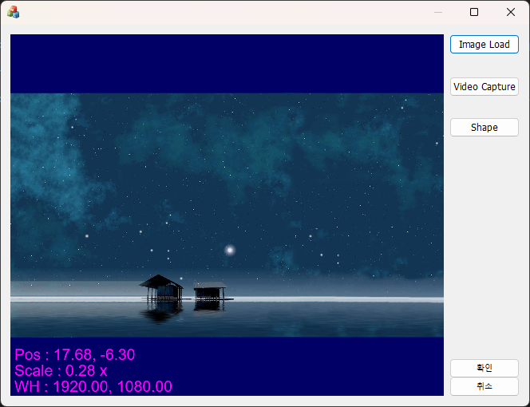

# OGLImageViewer
 MFC OpenGL Image Viewer. dll Lib형태로 작업하였으며, MFC에 Picture Frame에 Attach하는 방식.

 추가 기능은 해당 Lib를 수정하여야 하고, 단순 뷰어는 DLL로 Include 하여 사용.

## Done
	[x] Image Load
	[x] Mouse Position And Image Infomation
	[x] Shape Draw

## Todo
	[-]

## Feature
	- Mouse Wheel Up/Down : 이미지 확대/축소 (마우스 포인터 기준으로)
	- Mouse Left Drag : 이미지 Pan
	- Mouse Right Click : 1x Image
	- Mouse Wheel Click : Fit Image
	

## Library
	- freetype-2.13.3
	- glew-2.1.0
	- glfw-3.3.8
	- glm-1.0.1
	- opencv 4.5.4

## Directory Architecture
- $(SolutionDir)
	- Include
		- opencv
		- glm
		- glew
		- glfw
		- glm
  	-  Lib
		- freetype
		- glew
		- glfw
		- opencv_world454.dll
		- opencv_world454.lib
		- opencv_world454d.dll
		- opencv_world454d.lib
  - Bin

### ImageViewer : https://www.opengl-tutorial.org/
### Font :  https://learnopengl.com/In-Practice/Text-Rendering
### Shape :  https://stackoverflow.com/questions/3484260/opengl-line-width